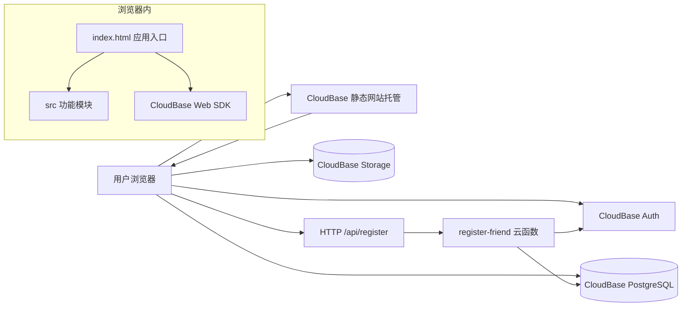
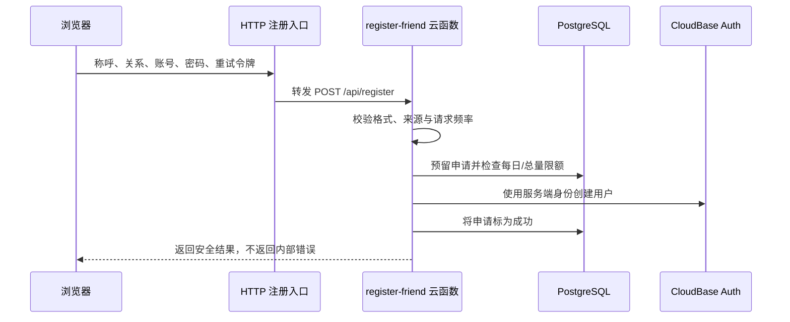

# 清水河最高机密

> Daily Todo / 今日待办技术文档  
> 文档版本：1.1\
> 对应程序版本：v1.3.2\
> 最后更新：2026-09-22  
> 项目仓库：<https://github.com/lntanovo/daily-todo>  
> 公网网站：<https://daily-todo-d3gq5mama7a468d02-1485775300.tcloudbaseapp.com/>

## 1. 文档说明

本文档供项目共同合作者阅读，用于说明网站的产品能力、整体架构、技术选型、代码目录、数据库、登录与注册、数据安全、测试、构建和上线流程。

仓库目前是公开仓库。因此，“清水河最高机密”是本文档标题，不代表文件中可以保存真正的密钥。本文档不会记录 Publishable Key、腾讯云 SecretId/SecretKey、用户密码、真实用户资料或其他私密数据。

## 2. 项目概览

这是一个电脑端优先、同时适配手机窄屏的个人待办网站。用户使用自己设置的账号和密码登录，每个账号拥有相互隔离的任务、完成状态、每日补充和背景设置。

当前主要功能：

- 暖色纸张风格的中英混排界面。
- 周视图，以及上一周、下一周、回到今天和年月日快速日历。
- 单日任务和连续日期范围任务。
- 日期范围任务每天分别记录完成状态。
- 任务优先级：紧急为红色，普通为蓝色。
- 可选每日开始时间和结束时间。
- 每个任务在每个日期可保存一条最多 500 字的“当日补充”。
- 用户可上传自己的 JPG、PNG、WebP 或 GIF 背景。
- 可点击、拖动并记忆位置的像素宠物，以及可关闭的花瓣动效。
- CloudBase 用户名密码登录、朋友自助注册和 PostgreSQL 云端保存。
- 旧版浏览器本地任务的一次性云端迁移。

## 3. 技术栈

| 层级 | 技术 | 用途 |
| --- | --- | --- |
| 页面 | HTML5 | 页面结构、表单和弹窗 |
| 样式 | CSS3 | Warm Paper 主题、响应式布局、动画和字体 |
| 浏览器逻辑 | 原生 JavaScript ES Modules | 任务、日历、补充、背景、宠物、登录和注册交互 |
| 前端 SDK | `@cloudbase/js-sdk` 3.x | 登录、PostgreSQL 数据访问和对象存储访问 |
| 开发与构建 | Vite 7 | 本地开发服务器、资源打包和生产构建 |
| 身份系统 | 腾讯云 CloudBase Auth | 用户名密码登录和会话管理 |
| 数据库 | CloudBase PostgreSQL | 用户任务、完成状态、每日补充、偏好和注册台账 |
| 文件存储 | CloudBase Storage | 保存用户上传的私有背景图 |
| 注册后端 | CloudBase 云函数 `register-friend` | 校验申请、执行限额并创建 CloudBase 用户 |
| 注册入口 | CloudBase HTTP 访问服务 | 将 `/api/register` 转发到注册云函数 |
| 自动测试 | Node.js 内置测试 + Playwright/Edge | 静态检查、注册逻辑和浏览器交互验收 |
| 版本管理 | Git + GitHub | 代码历史、版本标签和协作 |

项目不使用 React、Vue 或传统自建服务器。生产环境由静态前端、CloudBase 托管能力、云函数和云数据库共同组成。

## 4. 整体架构



### 4.1 普通登录与使用流程

1. 浏览器从静态托管读取构建后的 HTML、JavaScript、CSS、字体和图片。
2. `index.html` 使用环境变量初始化 CloudBase Web SDK。
3. 页面读取当前登录会话；未登录时只显示登录或注册界面。
4. 登录成功后，浏览器以当前用户身份读取 PostgreSQL。
5. 新建、编辑、完成或删除任务时，前端直接通过 CloudBase SDK 更新数据库。
6. PostgreSQL 的行级安全策略根据 `auth.uid()` 限制访问，用户只能操作自己的记录。

### 4.2 朋友注册流程



密码只交给 CloudBase 身份系统用于创建账号，不写入日程数据库，也不写入浏览器持久存储。数据库只保存注册申请的称呼、关系、账号、状态和不可逆摘要等管理信息。

## 5. 项目目录总览

以下结构以 Git 仓库中的源码为准。`node_modules`、`dist`、`.env.local` 等本机或生成内容不会提交到 GitHub。

```text
日程安排/
├─ index.html
├─ package.json
├─ package-lock.json
├─ vite.config.js
├─ .env.example
├─ .gitignore
├─ README.md
├─ THIRD_PARTY_NOTICES.md
├─ 清水河最高机密.md
├─ preview-*.png / qa-*.png
├─ src/
├─ assets/
│  └─ fonts/
│     └─ wenkai/
│        └─ files/
├─ background-originals/
├─ cloudbase/
│  ├─ migrations/
│  └─ operations/
├─ cloudfunctions/
│  └─ register-friend/
├─ docs/
└─ tests/
```

## 6. 根目录文件

| 文件 | 作用 |
| --- | --- |
| `index.html` | 应用主入口。包含主体页面结构、主要 Warm Paper 样式，以及任务状态、云端 CRUD、登录、退出、旧数据迁移等核心逻辑；同时导入 `src` 中拆分出的模块。 |
| `package.json` | 项目名称、版本、依赖和常用命令。生产依赖只有 CloudBase Web SDK，开发依赖为 Vite。 |
| `package-lock.json` | 锁定所有 npm 依赖的精确版本，使不同合作者安装出相同的依赖树。由 npm 自动维护。 |
| `vite.config.js` | Vite 配置。开发期动态提供浏览器功能测试夹具；生产构建时把字体许可证复制到 `dist/licenses`；同时调整 CloudBase SDK 打包体积警告阈值。 |
| `.env.example` | 环境变量模板，只写变量名和默认区域，不包含真实值。复制为 `.env.local` 后在本机填写。 |
| `.gitignore` | 定义不提交的内容，包括依赖、构建产物、本机密钥、日志、原始背景和测试截图产物。 |
| `README.md` | 面向使用者和开发者的快速说明，包含运行方式、主要功能、线上地址、版本记录和测试命令。 |
| `THIRD_PARTY_NOTICES.md` | 第三方字体、像素宠物和花瓣参考项目的来源与许可证。 |
| `清水河最高机密.md` | 本技术文档，面向共同合作者说明完整实现。 |
| `preview-dark.png` | 早期深色方案预览，保留作历史设计参考，当前产品不再提供深色主题。 |
| `preview-paper.png` | 暖色纸张方案桌面预览。 |
| `preview-mobile.png` | 窄屏/手机布局预览。 |
| `qa-before.png` | 早期质量检查截图。 |
| `qa-narrow-dialog.png` | 窄屏弹窗质量检查截图。 |

## 7. `src`：浏览器功能模块

### 7.1 `src/appearance.js`

负责个人背景功能：

- 展示纸张、精选图库和用户上传三种背景来源。
- 将用户偏好保存到 `todo_preferences`。
- 将用户图片上传到私有 `todo-backgrounds` 存储桶。
- 通过临时签名地址展示私有图片，并在到期前或页面重新可见时刷新地址。
- 使用“用户 ID/唯一文件名”的对象路径，确保不同用户互不冲突。
- 更换或恢复背景后清理不再使用的旧对象。
- 登录用户变化时使用代次标记丢弃迟到的异步结果，避免串号。

背景是一个固定定位的 ``，配合 CSS 的 `cover` 方式铺满窗口。全页暖色遮罩为 40%，标题、日期导航和任务清单直接显示在背景图上，不使用局部白色衬底；使用图片背景时也取消任务行的交替底色。页头标题为正体 `to do list`，副标题使用独立行高，工具栏可自动换行。图片背景上的正文和辅助文字使用更深的颜色，并通过八向、零模糊的 1px 浅色文字阴影形成细描边，隔开图片线条；小标签提高到 13px、600 字重。实色主要按钮和选中日期不加描边。思源宋体与霞鹜文楷保持不变，实际可读性仍会随用户图片的明暗和纹理变化。

### 7.2 `src/background-catalog.js`

精选背景的白名单配置。数组项格式为：

```js
{ id: "唯一标识", name: "显示名称", url: "/assets/backgrounds/文件名" }
```

当前保持为空，只有 lntano 确认过的图片才应加入。这个文件不负责用户个人上传。

### 7.3 `src/background-image.js`

负责上传前的图片检查和处理：

- 接受 JPEG、PNG、WebP 和 GIF。
- 原始文件读取上限为 30 MB。
- 静态图片限制总像素和最长边，最长边会缩至 2560 像素以内。
- 静态图通过 Canvas 转成质量约 0.82 的 WebP，最终文件不得超过 10 MB。
- GIF 和动态 WebP 不进行静态压缩，以保留动画，但仍受 10 MB 云存储限制。
- 原始图片不会被程序改写。

### 7.4 `src/calendar.js`

负责快速日历：

- 生成指定年月的星期一开头月历。
- 年份支持 1–9999，支持月份和年份直接切换。
- 显示跨月日期、今天状态和有任务日期的小圆点。
- 支持鼠标、触摸和键盘方向键。
- 包含闰年、跨年、月天数和日期键值工具。

### 7.5 `src/daily-notes.js`

负责“当日补充”：

- 以“任务 ID + 日期”作为唯一维度，因此连续任务每天可写不同内容。
- 每条最多 500 字，弹窗实时显示字数。
- 按日期懒加载并缓存，避免一次读取全部补充。
- 保存时使用数据库 upsert；清空内容时删除对应记录。
- 显示加载中、失败和重试状态。
- 渲染时使用纯文本，不把用户内容作为 HTML 执行。
- 用户退出或切换账号时清理缓存并隔离异步请求。

### 7.6 `src/companion.js`

负责像素宠物和花瓣：

- 使用 `assets/oneko.gif` 雪碧图和状态机播放走动、停留等动作。
- 宠物显示尺寸为 84 × 84 像素，是初版的 1.5 倍。
- 支持 Pointer Events，因此鼠标和触屏都可拖动。
- 用归一化坐标把位置保存在当前浏览器，窗口变化后仍能合理还原。
- 点击宠物会触发动作和随机回应。
- 平时生成低密度花瓣，完成任务时产生集中庆祝花瓣。
- 动效开关会记住选择，并尊重系统的“减少动态效果”偏好。

### 7.7 `src/companion.css`

只保存宠物、回应气泡、花瓣层、拖动状态和减少动效规则，使装饰层不会遮挡任务操作。

### 7.8 `src/features.css`

保存后来新增功能的样式，主要包括：

- 思源宋体和霞鹜文楷的 `@font-face`。
- 日历弹窗、当日补充、背景选择和上传界面。
- 背景图片层与暖色遮罩。
- 窄屏适配和不小于可用尺寸的点击区域。

### 7.9 `src/registration.js`

负责登录页、注册页和注册成功页之间的切换：

- `#join` 表示打开统一注册链接。
- 校验称呼、与 lntano 的关系、账号和密码。
- 账号必须为 5–24 位，以小写字母开头，只含小写字母、数字和下划线。
- 密码为 8–32 位，并满足多种字符组合要求。
- 登录和注册密码框都使用固定的显隐眼睛按钮。
- 调用公网 `/api/register`，设置超时并只向用户展示安全错误信息。
- 使用隐藏的蜜罐字段减少自动机器人提交。
- `sessionStorage` 只保存重复请求令牌；`localStorage` 只保存最近一次账号名；密码始终只存在于当前页面内存，提交后及时清除。

## 8. `assets`：随网站发布的静态资源

### 8.1 `assets/oneko.gif`

像素宠物雪碧图，来源和许可证见 `THIRD_PARTY_NOTICES.md`。

### 8.2 `assets/fonts`

| 文件或目录 | 作用 |
| --- | --- |
| `source-han-serif-cn.woff2` | 思源宋体 CN 可变 WOFF2，主要用于任务标题。 |
| `SourceHanSerif-LICENSE.txt` | 思源宋体的 SIL Open Font License。 |
| `LXGWWenKai-OFL.txt` | 霞鹜文楷原字体的 SIL Open Font License。 |
| `README.md` | 字体来源、版本、加载策略和许可证说明。 |
| `wenkai/lxgwwenkai-regular.css` | 霞鹜文楷 Regular 的 `@font-face` unicode-range 定义。 |
| `wenkai/LICENSE.txt` | 网页字体分包项目许可证。 |
| `wenkai/files/*.woff2` | 97 个按 Unicode 范围拆分的字体分片。浏览器只下载页面实际用到的字形，不会一次加载完整字库。 |

两种字体均由本站自托管，不依赖运行时的第三方字体服务。`font-display: swap` 会先显示系统字体，字体下载完成后再替换，避免空白文字。

## 9. `background-originals`：背景原始素材暂存区

`background-originals/README.md` 说明如何放置用户选中的原图。除 README 外，该目录内容被 Git 忽略，不会自动上传 GitHub 或发布到网站。

- 静态 JPG、PNG、WebP 可作为后续图库素材。
- GIF、动态 WebP 可保留动画。
- MP4、WebM 可作为未来视频背景素材，但当前上传入口不支持视频。

若要把某张图片做成所有用户可选的精选背景，应先处理成适合网页的大小，放入受版本管理的静态资源目录，再更新 `src/background-catalog.js`。

## 10. `cloudbase/migrations`：数据库迁移

迁移文件按时间顺序执行，并作为云端结构的唯一可追溯来源。已经上线的迁移原则上不回改；新需求应增加新的迁移文件。

### 10.1 `20260914143748_create_todo_tables.sql`

建立最初两张业务表：

- `todo_tasks`：任务主体。
- `todo_daily_completions`：某个任务在某一天的完成状态。

同时建立索引、外键、字段检查、数据库权限和行级安全策略。连续任务删除时，对应完成记录会级联删除。

### 10.2 `20260915190000_friend_registration.sql`

建立服务端专用的注册系统：

- `friend_registration_settings`：注册开关、每日限额、总限额和分钟级请求计数。
- `friend_registrations`：请求摘要、账号、用户 ID、称呼、关系、状态和时间。
- `reserve_friend_registration(...)`：预留一次注册并处理幂等、限额和租约。
- `complete_friend_registration(...)`：注册完成后更新状态。

普通匿名用户和已登录用户均无权直接读取这些表；只有 `service_role` 可访问。

### 10.3 `20260916100000_task_schedule_username.sql`

为任务增加：

- `priority`：`normal` 或 `urgent`。
- `start_time` 和 `end_time`：两者必须同时为空或同时存在，且开始时间早于结束时间。

同时增加用户自选账号的 `reserve_friend_registration_v2(...)`，以及失败时释放预留记录的 `cancel_friend_registration(...)`。

### 10.4 `20260918160000_daily_notes_background.sql`

增加：

- `todo_daily_notes`：每个任务每天一条补充，1–500 字。
- `todo_preferences`：用户当前背景类型和背景标识。
- 私有存储桶 `todo-backgrounds`：允许 JPEG、PNG、WebP、GIF，单文件最多 10 MB。
- 存储对象 RLS：对象路径的第一级目录必须等于当前用户 ID。

存储对象没有 UPDATE 权限。更换背景时上传一个新的唯一文件，再更新偏好并删除旧文件，降低覆盖和缓存问题。

## 11. `cloudbase/operations`：云端运维配置

| 文件 | 作用 |
| --- | --- |
| `20260914_restrict_authenticated_privileges.sql` | 进一步撤销浏览器用户不需要的 `TRUNCATE`、`REFERENCES` 和 `TRIGGER` 权限。 |
| `registration-access.rego` | 注册云函数的访问策略，只允许 `/api/register` 的 POST 和 OPTIONS；其他函数路径默认拒绝。 |
| `registration-gateway.json` | 注册 HTTP 入口配置，指向 `register-friend` 云函数，并按客户端 IP 限制为每秒 1 次。 |
| `registration-settings.sql` | 注册开关和限额的运维脚本。当前配置为每天最多 20 人、累计最多 100 人；也包含紧急关闭语句。 |

这些文件是“配置记录和运维依据”，不会因为提交到 Git 就自动修改云端；执行前必须确认目标环境。

## 12. `cloudfunctions/register-friend`：注册云函数

### 12.1 `index.js`

云函数主入口，负责：

- 解析 HTTP 请求并处理 CORS/OPTIONS。
- 限制允许的站点来源。
- 校验账号、密码、称呼、关系、重试令牌和蜜罐字段。
- 对敏感信息计算不可逆摘要，支持重复请求幂等处理。
- 调用 PostgreSQL RPC 预留注册名额。
- 调用腾讯云身份 API 创建用户。
- 处理用户名冲突、超额、关闭、并发中和服务不可用等状态。
- 成功后完成台账，失败时尽可能取消未完成预留。
- 向前端返回预先定义的安全消息，不泄露内部异常。

### 12.2 `cloud-api.js`

负责腾讯云 API 的 TC3 请求签名和网络调用。临时云函数凭据从运行环境或执行上下文读取，不硬编码在仓库中。

### 12.3 `package.json`

声明云函数名称、版本和入口。函数只使用 Node.js 内置能力和本目录代码，没有额外 npm 依赖。

### 12.4 云函数运行环境变量

部署时需要在云端设置变量名，而不是把真实值写进 Git：

- `APP_ENV_ID`：CloudBase 环境 ID。
- `APP_REGION`：腾讯云地域，默认 `ap-shanghai`。
- `CLOUDBASE_API_KEY`：云函数访问数据库 REST/RPC 的服务端密钥。
- `REGISTRATION_BINDING_KEY`：注册请求绑定摘要所用的服务端秘密。
- `ALLOWED_ORIGINS`：允许调用注册接口的网站来源列表。
- `TENCENTCLOUD_SECRETID`、`TENCENTCLOUD_SECRETKEY`、`TENCENTCLOUD_SESSIONTOKEN`：通常由云函数运行环境临时注入。

## 13. `docs`：历史说明与人工操作指引

| 文件 | 作用 |
| --- | --- |
| `你回来后只需要做的一件事.md` | 某个阶段留给项目所有者的简化操作指引，属于历史协作记录。 |
| `网站化缺口与路线.md` | 从纯本地页面转为多人网站时的缺口分析和路线记录。 |
| `GitHub参考项目.md` | 宠物、花瓣等界面功能参考的 GitHub 项目和使用边界。 |

这些文件帮助理解决策过程；当前实现和实际操作应优先以根目录 README、本文档和最新代码为准。

## 14. `tests`：检查与自动验收

| 文件 | 作用 |
| --- | --- |
| `project-check.mjs` | 快速静态检查。验证关键文件、生产配置、安全约束、RLS 迁移和已删除旧主题等项目事实。 |
| `registration.test.cjs` | 注册云函数单元测试。通过依赖注入验证格式、限额、幂等、用户名冲突恢复、密码不落库和签名逻辑。 |
| `features.test.mjs` | 完整浏览器功能测试。使用本机 Edge/Playwright 检查补充、日历、背景、字体、上传失败、移动端布局和退出等。 |
| `fake-cloudbase.js` | 仅供本地浏览器测试的 CloudBase 假实现，以浏览器本地数据模拟数据库、登录和存储。生产包不使用。 |
| `edge-password-toggle.mjs` | 通过 Edge DevTools 协议测试登录页、固定密码眼睛、动效、优先级、时间和响应式布局。 |
| `edge-registration-checks.mjs` | 测试注册页面；只有显式设置测试开关时才会进行真实注册和云端任务测试。 |
| `companion-fixture.html` | 独立测试像素宠物拖动、点击和动效的页面。 |
| `artifacts/` | 自动测试截图输出目录，被 Git 忽略，不属于正式源码。 |

Vite 的开发期插件会动态提供 `/tests/features-fixture.html`：它复用真实页面，但把 CloudBase SDK替换为 `fake-cloudbase.js`，并显示“本地交互预览”提示。该路径不会进入生产构建。

## 15. 数据模型

### 15.1 `todo_tasks`

| 字段 | 含义 |
| --- | --- |
| `owner_id` | 所属用户，默认取 `auth.uid()`。 |
| `id` | 浏览器生成的任务 ID；与 `owner_id` 组成主键。 |
| `title` | 任务标题，去除首尾空白后 1–160 字。 |
| `type` | `single` 单日任务或 `range` 日期范围任务。 |
| `task_date` | 单日任务日期。 |
| `start_date` / `end_date` | 范围任务的起止日期，包含首尾。 |
| `priority` | `normal` 普通或 `urgent` 紧急。 |
| `start_time` / `end_time` | 可选的每天起止时间。 |
| `created_at` / `updated_at` | 创建和更新时间。 |

### 15.2 `todo_daily_completions`

主键是 `owner_id + task_id + completion_date`。因此，一个连续多日任务可以在周一完成、周二未完成，互不影响。

### 15.3 `todo_daily_notes`

主键是 `owner_id + task_id + note_date`。内容限制 1–500 字；删除任务时补充通过外键级联删除。

### 15.4 `todo_preferences`

每个用户一行。`background_kind` 只能是：

- `paper`：默认暖纸，`background_value` 为空。
- `preset`：精选背景，值为背景目录中的安全 ID。
- `upload`：私有上传，值必须以当前用户 ID 作为路径首段。

### 15.5 注册相关表

`friend_registration_settings` 保存注册开关与限额。`friend_registrations` 是管理员/服务端台账，其中可以查看朋友填写的称呼和“与 lntano 的关系”；普通网站用户无法访问。

## 16. 前端状态与数据保存

登录后的业务数据以云数据库为准。浏览器仍会少量使用 `localStorage` 或 `sessionStorage`，但用途有限：

| 浏览器内容 | 用途 | 是否包含密码 |
| --- | --- | --- |
| 旧版 `daily-todo.tasks.v1` 等键 | 兼容旧版本地任务并支持一次性迁移 | 否 |
| 最近账号名 | 方便下次登录填写 | 否 |
| 宠物位置 | 记住当前浏览器中的宠物坐标 | 否 |
| 动效偏好 | 记住是否关闭动画 | 否 |
| 注册请求令牌 | 网络中断后安全重试同一次注册 | 否 |

前端保存任务时采用差异同步：新增或修改任务执行写入，已删除任务执行删除，完成状态按键值差异增删。旧本地任务的云端迁移是幂等的，并保留原始本地备份。

## 17. 身份、权限与安全边界

### 17.1 可公开内容

以下内容本来就会被浏览器下载或可安全公开：

- HTML、CSS、浏览器 JavaScript。
- 图片、字体和开源许可证。
- CloudBase 环境 ID、地区、公开网站地址。
- Web 端 Publishable Key。它用于识别应用，不等同于服务端管理密钥，但仍只放在被忽略的 `.env.local` 中进行构建配置。

### 17.2 绝对不能提交的内容

- `.env.local` 的真实值。
- 腾讯云 SecretId、SecretKey、SessionToken。
- `CLOUDBASE_API_KEY`。
- `REGISTRATION_BINDING_KEY`。
- 用户密码或导出的真实用户资料。
- 云端数据库备份、访问日志和带身份信息的调试输出。

### 17.3 数据隔离

- 任务、完成、补充和偏好表启用了 PostgreSQL RLS。
- 写入时不信任浏览器传来的 owner 值，而由 `auth.uid()` 和 RLS判断。
- 背景存储桶是私有的，路径首段必须是当前用户 ID。
- 注册台账对匿名用户和普通已登录用户撤销全部权限，只允许服务端角色访问。
- 注册 HTTP 入口还有来源校验、格式校验、蜜罐、每日/累计限额、分钟限制、IP QPS 和幂等保护。

### 17.4 前端输出安全

用户输入的任务和补充以 `textContent` 或等价纯文本方式显示，不拼接成可执行 HTML，从而降低脚本注入风险。云函数不把原始内部错误直接返回浏览器。

## 18. 本地开发

### 18.1 环境要求

- Windows 电脑。
- Node.js 和 npm。
- VS Code 或其他代码编辑器。
- Microsoft Edge 用于人工/自动浏览器验收。

### 18.2 第一次运行

在项目目录打开终端：

```powershell
npm install
Copy-Item .env.example .env.local
```

然后在 `.env.local` 填写当前 CloudBase Web 环境参数。不要提交这个文件。

### 18.3 启动开发页面

```powershell
npm run dev
```

通常访问 `http://127.0.0.1:5173/`。终端关闭后，本地开发地址也会停止。由于 CloudBase 试用环境的域名白名单限制，真实云端登录验收优先使用公网网站。

## 19. 检查、测试与构建

推荐依次执行：

```powershell
npm run check
npm run test:registration
npm run test:features
npm run build
```

命令说明：

- `npm run check`：快速检查项目结构和重要安全条件。
- `npm run test:registration`：运行不访问真实云端的注册后端单元测试。
- `npm run test:features`：启动测试夹具并用浏览器验收主要功能。
- `npm run build`：生成生产文件到 `dist/`。
- `npm run preview`：在本机预览已经构建的 `dist/`。

`dist` 是构建成品，可以重新生成，因此不提交 Git。`node_modules` 是下载的依赖，也不提交 Git。

## 20. 部署与上线

一次完整上线可能包含四个彼此独立的部分：

1. **数据库变更**：按时间顺序应用新的 `cloudbase/migrations/*.sql`，确认 RLS 和权限。
2. **注册后端变更**：更新 `cloudfunctions/register-friend`，并核对云函数环境变量、HTTP 路由和 Rego 策略。
3. **静态网站变更**：使用生产环境变量运行 `npm run build`，将 `dist` 上传到 CloudBase 静态网站根目录。
4. **验证**：打开公网地址，确认首页、登录、注册、任务读写、刷新、退出和窄屏显示；检查浏览器控制台无错误。

静态网站的首页和错误页都应回到 `index.html`，以保证带 `#join` 等地址仍能进入应用。

默认 CloudBase 测试域名第一次访问可能出现腾讯云风险提示，点击确认后进入。这是平台测试域名行为，不是应用错误。

## 21. Git 与 GitHub 协作约定

仓库：<https://github.com/lntanovo/daily-todo>

建议合作者遵守：

1. 开始工作前先同步 `main`。
2. 一项功能使用一个清晰分支或一组聚焦提交。
3. 不修改已经在生产执行过的迁移，新增后续迁移。
4. 提交前运行与改动范围相符的测试，至少运行 `npm run check` 和 `npm run build`。
5. 不提交 `.env.local`、`node_modules`、`dist`、测试截图、原始背景或真实用户数据。
6. 新增第三方代码、图片、字体或素材时，先确认许可证，再更新 `THIRD_PARTY_NOTICES.md`。
7. 上线后记录版本、迁移、云函数和静态文件是否都已部署，避免只更新其中一层。

现有版本标签记录了阶段性发布。本文档对应的当前产品版本为 `v1.3.2`。

## 22. 常见改动应该去哪里

| 想修改的内容 | 优先查看 |
| --- | --- |
| 页面主结构、任务表单、任务 CRUD | `index.html` |
| 每日补充 | `src/daily-notes.js`、`src/features.css`、对应数据库迁移 |
| 快速日历 | `src/calendar.js`、`src/features.css` |
| 背景上传和展示 | `src/appearance.js`、`src/background-image.js`、`src/features.css` |
| 精选背景列表 | `src/background-catalog.js` |
| 宠物和花瓣 | `src/companion.js`、`src/companion.css`、`assets/oneko.gif` |
| 登录/注册页面 | `src/registration.js` 和 `index.html` 中的登录结构/样式 |
| 注册服务端规则 | `cloudfunctions/register-friend`、`cloudbase/operations`、注册迁移 |
| 数据库字段或权限 | 新建 `cloudbase/migrations` 迁移 |
| 字体 | `assets/fonts`、`src/features.css`、许可证文件 |
| 自动测试 | `tests` 和 `vite.config.js` 的测试夹具 |
| 构建与开发配置 | `package.json`、`vite.config.js`、`.env.example` |

## 23. 已知边界与后续注意事项

- 当前没有短信、邮箱验证或找回密码流程；账号发放依赖统一注册入口和管理员控制的注册限额。
- 当前总量限制为 100、每日限制为 20，扩大用户范围前应评估 CloudBase 套餐、滥用风险和运维能力。
- 网站使用 CloudBase 默认测试域名；若用于更正式或更广泛的公开服务，可考虑备案后的自有域名。
- 用户背景使用临时签名地址，私有性更好，但必须继续维护刷新逻辑。
- 大字体资源会增加首次访问流量；霞鹜文楷已分片，思源宋体仍是较大的单文件。
- `index.html` 仍承载较多核心逻辑。功能继续增长时，可按任务仓储、认证会话和 UI 渲染进一步拆分模块，但拆分前应先补足回归测试。
- 真实双账号数据隔离、密码找回和灾难恢复应在扩大开放前形成固定的人工验收清单。

## 24. 第三方资源

项目包含或参考：

- Adobe Source Han Serif / 思源宋体，SIL Open Font License 1.1。
- LXGW WenKai / 霞鹜文楷，SIL Open Font License 1.1。
- lxgw-wenkai-webfont 的字体分包，MIT License。
- oneko.js 的宠物素材和状态机参考，MIT License。
- Sakura.js 的花瓣时序与生命周期灵感，MIT License。

完整来源、版本和许可证正文见 `THIRD_PARTY_NOTICES.md` 及 `assets/fonts` 下的许可证文件。

## 25. 交接检查清单

共同合作者首次接手时，应确认：

- [ ] 可以访问 GitHub 仓库，但没有在仓库中发现真实密钥。
- [ ] 本机已安装 Node.js/npm，`npm install` 成功。
- [ ] 已从安全渠道取得开发所需环境值，并只写入 `.env.local`。
- [ ] `npm run check`、`npm run test:registration` 和 `npm run build` 通过。
- [ ] 理解浏览器端代码无权读取其他用户数据，数据隔离依赖 RLS，不能随意关闭。
- [ ] 理解注册台账只能由服务端/管理员读取。
- [ ] 数据库改动使用新迁移，部署前有备份或回滚方案。
- [ ] 静态站点、云函数、数据库和存储是四个不同部分，上线时逐项核对。
- [ ] 新第三方素材已检查许可证并补充声明。

---

如果代码、云端配置与本文档发生冲突：先不要猜测，也不要直接修改生产环境。应以 Git 中最新代码、已执行迁移记录和 CloudBase 控制台实际状态三者交叉核对，再更新实现和本文档。
